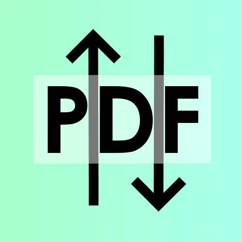
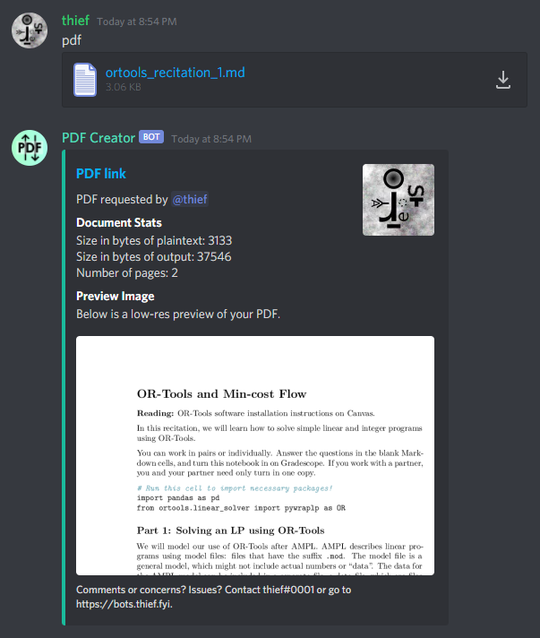

## bots.thief.fyi
### I've created way too many Discord bots. 

All bots are written in discord.py, by thief#0001. Message me on Discord if you have any questions or comments.

## Bots
- [TeXas](#TeXas)
- [Simple LaTeX Bot](#Simple%20LaTeX%20Bot)
- [ADLBot](#ADLBot)
- [PDF Creator](#PDF%20Creator)
- [Chessbot](#Chessbot)

#  TeXas <a name="TeXas"></a>

TeXas is a multipurpose bot that can render LaTeX, do math, and create 2-dimensional graphs. For this, it uses:
 - pdflatex
 - pdfcrop
 - ImageMagick
 - gnuplot
 - Xcas/Giac
 
To render LaTeX, TeXas first creates a PDF with pdflatex, then crops it to the content with pdfcrop, and finally, converts it to a PNG with ImageMagick. There are two settings for density (low and high quality) that either produce a 300 DPI image or 3000 DPI image. The image is saved to a file and uploaded.

To create the 2-dimensional graphs, TeXas uses gnuplot. The user can specify the desired range of the graph, and can of course give a function of x to plot. The plot is saved to a file and uploaded.

To solve equations or do numerical math, TeXas uses giac (the CLI backend of Xcas, a powerful computer algebra system). TeXas takes user input, and passes it to giac. The result is stored in a file, along with its LaTeX representation. The user can choose whether they want their output in text form or in the form of a LaTeX PNG, in which case TeXas renders the LaTeX as usual with pdflatex etcetera.

TeXas used to use SymPy to do math, but there were several issues. The first issue was that SymPy was rather slow. The second one was that I was an idiot and allowed users to execute arbitrary code, because I was doing the following:

```python
from sympy import * # imported all SymPy functions
...
exec(<arbitrary code>) # was supposed to allow users to access the SymPy functions
```

I wasn't planning on creating a GitHub repo for TeXas at this time, so I had stored the bot's token in plaintext in the bot.py file itself. After one user tried `solve print("TOKEN")` I decided to switch to giac, which worked very well.

#  Simple Latex Bot <a name="Simple LaTeX Bot"></a>

This bot was created as a basic template for a LaTeX bot. It simply renders LaTeX as PNGs, much like TeXas.

#  ADLBot <a name="ADLBot"></a>

ADLBot is a simple bot which checks users' messages for words or phrases which are considered "hate speech" by the ADL (Anti-Defamation League) and alerts users as to which words or phrases triggered the bot. For this, it uses a CSV file of words, and checks the substrings of a user's text against the contents of this file.

#  PDF Creator <a name="PDF Creator"></a> 



PDF Creator was made to convert various plaintext files into PDFs. For this, it uses a simple pandoc command. It also has some extra features, which include displaying statistics about the conversion (the sizes in bytes of the plaintext input file and the PDF output, and the number of pages the PDF has) as well as a preview of the PDF, which is created using ImageMagick. 

The input files should be formatted with typical [pandoc Markdown syntax](https://pandoc.org/MANUAL.html#pandocs-markdown). PDF Creator accepts attachments with .md and .txt extensions, or text straight from Discord's text input field. Only one attachment can be processed at a time per message.

By default, the "prefix" for PDF Creator is simply "pdf", which should be entered in the "Comments" field if uploading an attachment and should precede any text entered in the text field (followed by a space) if the text field is being used instead of an attachment. 

The PDF files themselves are hosted on the site [femto.pw](https://v2.femto.pw) using a `curl` command. The site doesn't have a specified limit to filesize, but a PDF created by PDF Creator shouldn't ever be more than a couple MB anyway.

#  Chessbot <a name="Chessbot"></a>

This bot was not actually created by me at first; it was instead forked from someone else's chessbot. However, they hadn't touched it in ages and it had broken with updates to Discord's API. I rewrote the bot so that it was compatible with the Discord API rewrite, and added some other features (updating the image instead of re-sending it, using embeds instead of simple image uploads, allowing interactivity with reactions, implementing resignations and draws, etcetera). 

To fix an issue that popped up, I hosted all images of the chessboards on Discord in a burner channel of a private server. The issue with this, of course, was that it was slow (really, any Discord-based chessbot probably will be). The other main issue with chessbot is that it could only play one game at a time. That could probably be fixed without too much pain but I decided that it wasn't really worth it; the bot was kind of a fun project and there already were other, more mainstream, chess bots that had huge databases and stuff, so I decided to just let it go.
